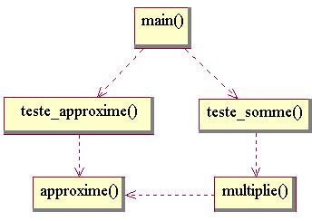

# [TP Coefs : Programmation Procédurale](README.md "wikilink")

Tout nombre réel peut être approximé par le rapport entre deux nombres entiers. Pour simplifier les éventuels calculs, on décide que l'entier au dénominateur sera une puissance de deux. En effet, la multiplication ou la division d'un entier par une puissance de deux se réalise simplement en décalant les bits de l'entier vers la gauche ou vers la droite.

On approximera donc tout réel r par une fraction `numerateur`/2^`exposant`^. Plus les valeurs de `numerateur` et `exposant` sont élevées, plus l'approximation peut-être précise. Par exemple, 0.65 peut être approximé successivement par 1/2^1^ (0.5), 3/2^2^ (0.75), 5/2^3^ (0.625), ... On choisira donc les nombres les plus élevés possibles, dans les limites fixés par le système, c'est à dire par le nombre de bits disponibles pour coder ces nombres.

Dans le cadre du TP, on va faire varier arbitrairement le nombre de bits autorisés pour stocker le numérateur, et calculer l'effet sur la précision de l'approximation. On notera que si on dispose de N bits pour stocker un entier, le plus grand entier possible est égal à 2^N^-1.

Pour amorcer le TP : comprenez, compilez et éxécutez le fichier [tp1\_procedural\_etape00.cpp](https://github.com/ReseauDevlog/SynopeCpp/raw/master/session-2016-04-idf/coefs/tp1_procedural_etape00.cpp), comprenant de petites fonctions utiles pour la suite.

Accès à la [section théorique correspondante](TheorieClassique "wikilink").

## 1\) Ajout d'une boucle

On veut approximer la valeur **0.65** par le rapport d'un numérateur entier et d'une puissance de deux au dénominateur. Ecrivez un programme qui calcule la valeur du numérateur pour un dénominateur valant **2**, **2^2^**, **2^3^**... **2^8^**. Afficher la valeur que l'on approxime, la valeur du numérateur, et la puissance de deux au dénuménateur :

    0.65 ~ 1/2^1
    0.65 ~ 3/2^2
    0.65 ~ 5/2^3
    0.65 ~ 10/2^4
    0.65 ~ 21/2^5
    0.65 ~ 42/2^6
    0.65 ~ 83/2^7
    0.65 ~ 166/2^8

[solution](https://github.com/ReseauDevlog/SynopeCpp/raw/master/session-2016-04-idf/coefs/tp1_procedural_etape01.cpp)

## 2\) Ajout d'une fonction

Placez le programme précédent dans une fonction appelée `approxime(...)`, qui prend en argument la valeur réelle à approximer. Modifiez le programme principal pour qu'il appelle cette fonction avec les valeurs **0.65** et **0.35**. Le programme principal doit être :

``` cpp
int main()
 {
  std::cout << std::endl ;
  approxime(0.65) ;
  std::cout << std::endl ;
  approxime(0.35) ;
  std::cout << std::endl ;
  return 0 ;
 }
```

[solution](https://github.com/ReseauDevlog/SynopeCpp/raw/master/session-2016-04-idf/coefs/tp1_procedural_etape02.cpp)

## 3\) Calcul de l'approximation

Ajoutez dans la fonction `approxime(...)` l'affichage de la valeur approximée, qui se calcule en divisant chaque numérateur par la puissance de deux associée. Attention, la division d'un entier par un entier retourne un entier : **3/4** vaut **0**. Une division retourne un réel si l'un des termes est réel : **3./4** ou **double(3)/4** vaut **0.75**.

L'affichage attendu est le suivant :

    0.65 ~   1/2^1 = 0.5
    0.65 ~   3/2^2 = 0.75
    0.65 ~   5/2^3 = 0.625
    0.65 ~  10/2^4 = 0.625
    0.65 ~  21/2^5 = 0.65625
    0.65 ~  42/2^6 = 0.65625
    0.65 ~  83/2^7 = 0.648438
    0.65 ~ 166/2^8 = 0.648438
    
    0.35 ~   1/2^1 = 0.5
    0.35 ~   1/2^2 = 0.25
    0.35 ~   3/2^3 = 0.375
    0.35 ~   6/2^4 = 0.375
    0.35 ~  11/2^5 = 0.34375
    0.35 ~  22/2^6 = 0.34375
    0.35 ~  45/2^7 = 0.351562
    0.35 ~  90/2^8 = 0.351562

[solution](https://github.com/ReseauDevlog/SynopeCpp/raw/master/session-2016-04-idf/coefs/tp1_procedural_etape03.cpp)

## 4\) Recherche de la meilleure approximation pour un numérateur maximum donné.

Plus le numérateur et l'exposant au dénominateur sont grands, plus l'approximation est précise. Dans `approxime(...)`, modifiez la boucle pour qu'elle recherche le meilleur couple numerateur/exposant, sans que le numérateur ne dépasse une certaine valeur maximale passez en argument à la fonction. Ne conservez les affichages que pour ce meilleur couple, mais afficher aussi la valeur du numérateur maximum autorisé. Utilisez le programme principal suivant :

``` cpp
int main()
 {
  std::cout << std::endl ;
  approxime(15,0.65) ;
  approxime(255,0.65) ;
  std::cout << std::endl ;
  approxime(15,0.35) ;
  approxime(255,0.35) ;
  std::cout << std::endl ;
  return 0 ;
 }
```

L'affichage attendu est le suivant :

    0.65 ~  10/2^4 = 0.625
    0.65 ~ 166/2^8 = 0.648438
    
    0.35 ~  11/2^5 = 0.34375
    0.35 ~ 179/2^9 = 0.349609

[solution](https://github.com/ReseauDevlog/SynopeCpp/raw/master/session-2016-04-idf/coefs/tp1_procedural_etape04.cpp)

## 5\) Calcul du numérateur maximum en fonction du nombre de bits

La plus grande valeur utilisable pour le numérateur dépend du nombre de bits utilisés pour représenter ce nombre entier. Dans les arguments de `approxime(..)`, remplacez l'argument désignant la valeur maximale par un argument désignant le nombre maximum de bits et corrigez en conséquence le corps de la fonction, en utilisant la fonction `entier_max(...)`. Dans l'affichage, remplacez le numérateur maximum par le nombre de bits. Dans le programme principal, faites deux boucles qui font varier le nombre de bits de 2 à 8 par pas de 2, l'une qui appelle `approxime(...)` pour **0.65**, et l'autre pour **0.35**. L'affichage attendu est le suivant :

    2 bits : 0.65 ~   3/2^2 = 0.75
    4 bits : 0.65 ~  10/2^4 = 0.625
    6 bits : 0.65 ~  42/2^6 = 0.65625
    8 bits : 0.65 ~ 166/2^8 = 0.648438
    
    2 bits : 0.35 ~   3/2^3 = 0.375
    4 bits : 0.35 ~  11/2^5 = 0.34375
    6 bits : 0.35 ~  45/2^7 = 0.351562
    8 bits : 0.35 ~ 179/2^9 = 0.349609

[solution](https://github.com/ReseauDevlog/SynopeCpp/raw/master/session-2016-04-idf/coefs/tp1_procedural_etape05.cpp)

## 6\) Déplacement des affichages dans une nouvelle fonction intermédiaire

Entre `main(...)` et `approxime(...)`, insérez la nouvelle fonction `teste_approxime(...)` ci-dessous, dans laquelle on regroupe tous les affichages. Corriger la fonction `main(...)` pour qu'elle appelle `teste_approxime(...)` à la place d'`approxime(...)`. Enlevez les affichages de la fonction `approxime(...)`, et ajoutez deux arguments par lesquels elle doit retourner les meilleurs numérateur et exposant qu'elle a calculé.

``` cpp
#include <iomanip>  
  
void teste_approxime( int bits, double valeur )
 {
  int numerateur, exposant, erreur ;
  approxime(bits,valeur,numerateur,exposant) ;
  double approximation = double(numerateur)/fois_puissance_de_deux(1,exposant) ;
  erreur = arrondi(100*(valeur-approximation)/valeur) ;
  if (erreur<0) { erreur = -erreur ; }
  std::cout
    << bits << " bits : " << valeur << " ~ "
    << std::setw(8) << approximation
    <<" ("<<erreur<<"/100)"
    <<" ("<<numerateur<<"/2^"<<exposant<<")"
    <<std::endl ;
 }
```

[solution](https://github.com/ReseauDevlog/SynopeCpp/raw/master/session-2016-04-idf/coefs/tp1_procedural_etape06.cpp)

## 7\) Multiplication approximée

Ecrivez la fonction `multiplie(...)` qui calcule le produit approximé d'un coefficient réel par un nombre entier et retourne un entier. Cette fonction doit approximer le réel à l'aide de la fonction `approxime(...)` ci-dessus. Les arguments de `multiplie(...)` sont le nombre maximum de bits pour l'approximation, le coefficient réel et le nombre entier. On ajoute une nouvelle boucle dans la fonction principale, afin de calculer l'approximation de **0.65\*3515+0.35\*4832** à l'aide de la nouvelle fonction `multiplie(...)`, pour un nombre de bits allant de 1 à 8 :

``` cpp
int main()
 {
  int bits ;
  
  std::cout << std::endl ;
  
  for ( bits=2 ; bits<=8 ; bits=bits+2 )
   { teste_approxime(bits,0.65) ; }

  std::cout << std::endl ;
  
  for ( bits=2 ; bits<=8 ; bits=bits+2 )
   { teste_approxime(bits,0.35) ; }

  std::cout<<std::endl ;
  
  for ( bits=1 ; bits<=8 ; bits=bits+1 )
   {
    int exact = arrondi(0.65*3515+0.35*4832) ;
    int approx = multiplie(bits,0.65,3515) + multiplie(bits,0.35,4832) ;
    std::cout << bits << " bits : 0.65*3515+0.35*4832 = " << exact << " ~ " << approx << std::endl ;
   }

  std::cout << std::endl ;
  
  return 0 ;
 }
```

[solution](https://github.com/ReseauDevlog/SynopeCpp/raw/master/session-2016-04-idf/coefs/tp1_procedural_etape07.cpp)

## 8\) Déplacement des affichages dans une nouvelle fonction intermédiaire

De même que nous l'avons déjà fait pour la fonction `teste_approxime(...)`, créez une fonction `teste_somme(...)` qui va servir à centraliser les affichages liés aux tests sur la somme pondérée **0.65\*3515+0.35\*4832**. `teste_somme(...)` doit différer de `teste_approxime(...)` sur quelques points. Notamment, le calcul d'erreur doit être fait en millièmes, et la fonction `teste_somme(...)` a cinq arguments : nombre de bits, premier coefficient réel, premier nombre entier, deuxième coefficient réel, deuxième nombre entier. Simplifiez le programme principal en ne laissant qu'un appel à `teste_somme(bits,0.65,3515,0.35,4832)` dans la dernière boucle. L'affichage à obtenir est le suivant :

    2 bits : 0.65 ~     0.75 (15/100)
    4 bits : 0.65 ~    0.625 (4/100)
    6 bits : 0.65 ~  0.65625 (1/100)
    8 bits : 0.65 ~ 0.648438 (0/100)
    
    2 bits : 0.35 ~    0.375 (7/100)
    4 bits : 0.35 ~  0.34375 (2/100)
    6 bits : 0.35 ~ 0.351562 (0/100)
    8 bits : 0.35 ~ 0.349609 (0/100)
    
    1 bits : 3976 ~ 2965 (254/1000)
    2 bits : 3976 ~ 4448 (119/1000)
    3 bits : 3976 ~ 4008 (8/1000)
    4 bits : 3976 ~ 3857 (30/1000)
    5 bits : 3976 ~ 3967 (2/1000)
    6 bits : 3976 ~ 4004 (7/1000)
    7 bits : 3976 ~ 3977 (0/1000)
    8 bits : 3976 ~ 3968 (2/1000)

[solution](https://github.com/ReseauDevlog/SynopeCpp/raw/master/session-2016-04-idf/coefs/tp1_procedural_etape08.cpp)

## \*) Diagramme UML



## 9\) Mise en commun de la boucle

Créez une fonction `boucle(...)` qui prend en argument :

  - un nombre de bits initial
  - un nombre de bits final
  - un increment à appliquer au nombre de bits
  - un pointeur vers une fonction à exécuter pour chaque nombre de bits

Créez des fonctions intermédiaire de tests et réorganisez le code de la fonction main() en conséquence.

``` cpp
...

void teste_065( int bits )
 { teste_approxime(bits,0.65) ; }

void teste_035( int bits )
 { teste_approxime(bits,0.35) ; }

void teste_065_3515_035_4832( int bits )
 { teste_somme(bits,0.65,3515,0.35,4832) ; }

...

int main()
 {
  std::cout<<std::endl ;
  boucle(2,8,2,teste_065) ;
  boucle(2,8,2,teste_035) ;
  boucle(1,8,1,teste_065_3515_035_4832) ;
  return 0 ;
 }
```

[solution](https://github.com/ReseauDevlog/SynopeCpp/raw/master/session-2016-04-idf/coefs/tp1_procedural_etape09.cpp)

## 10\) Création de tableaux dynamiques

Modifiez la fonction ci-dessous, qui produit une valeur réelle aléatoire, pour qu'elle produise et retourne un tableau de valeurs. La fonction prendra en argument d'entrée la taille demandée pour le tableau.

*Note : les trois premieres ligne de la fonction servent a preparer le generateur* *et sont a executer une seule fois. Seule la derniere instructions (dis(gen)) doit* *etre repetee autant de fois aue necessaire remplir chaque element du tableau.*

*Note : la nouvelle fonction a pour signature `double * rand_coefs( int taille )`.*

``` cpp
...
#include <random>
...
double rand_coef()
 {
  std::random_device rd;
  std::mt19937 gen(rd());
  std::uniform_real_distribution<> dis(0,1);
  return dis(gen) ;
 }
```

Cette fonction peut maintenant être utilisée pour ajouter une nouveau test à votre programme :

``` cpp
...
void teste_rand_coefs( int bits )
 {
  int taille = 10 ;
  double * values = rand_coefs(taille) ; 
  int i ;
  for ( i=0 ; i<taille ; i++ )
   { teste_approxime(bits,values[i]) ; }
  std::cout<<std::endl ;
  ???
 }
...

it main( int argc, char *argv[] )
 {
  ...
  boucle(1,8,1,teste_rand_coefs) ;
  return 0 ;
 }
```

Finalement, on aimerait que l'utilisateur puisse donner le nombre de coefficients aléatoires sur la ligne de commande, lorsqu'il appelle le programme : faites en sorte que `teste_rand_coefs()` récupèrer ce nombre et s'en serve de taille de tableau.

[solution](https://github.com/ReseauDevlog/SynopeCpp/raw/master/session-2016-04-idf/coefs/tp1_procedural_etape10.cpp)

## 11\) Ecrire dans un fichier

Modifiez votre programme pour qu'il écrive ses résultats dans un fichier, au lieu de les afficher à l'écran.

Le nom du fichier de sortie sera fournit par l'utilisateur comme deuxième argument sur la ligne de commande.

C'est mal, mais pour se faciliter un peu la vie, on créera l'objet de type fichier dans le programme principal, et on enregistrera son adresse dans une variable globale de type `std::ostream *`.

[solution](https://github.com/ReseauDevlog/SynopeCpp/raw/master/session-2016-04-idf/coefs/tp1_procedural_etape11.cpp)

  
  
© *CNRS 2016*  
*Assemblé et rédigé par David Chamont, cette œuvre est mise à disposition selon les termes de la [Licence Creative Commons - Attribution - Pas d’Utilisation Commerciale - Partage dans les Mêmes Conditions 4.0 International](http://creativecommons.org/licenses/by-nc-sa/4.0/)*
