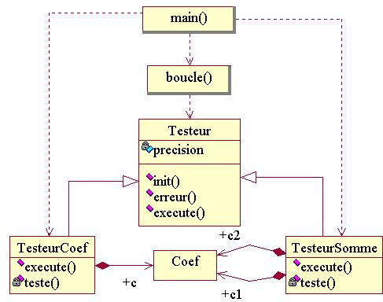

# [TP Coefs : Programmation Orientée Objet](README.md)

\_\_FORCETOC\_\_

Ici, on revoit le code pour y introduire des objets et des classes.  
Il est conseillé de partir du fichier [tp2\_objets\_etape00.cpp](https://github.com/ReseauDevlog/SynopeCpp/raw/master/session-2016-04-idf/coefs/tp2_objets_etape00.cpp).  
Accès à la [section théorique correspondante](TheorieObjets.md).

## 1\) Regroupement du numérateur et de l'exposant associé dans une classe Coef

Créez la classe `Coef`, qui représente un nombre réel sous la forme d'un numérateur entier divisé par une puissance de deux. Dotez la classe de deux variables membres entières publiques nommées `numerateur_` et `exposant_`. Modifiez `approxime(...)` pour qu'elle manipule un objet de type `Coef` au lieu d'agir sur deux entiers passés par référence. Les fonctions `teste_approxime(...)` et `multiplie(...)` doivent être corrigées en conséquence. La déclaration d'`approxime(...)` doit être :

``` cpp
void approxime( int bits, double valeur, Coef & coef )
 {
  ...
```

[solution](https://github.com/ReseauDevlog/SynopeCpp/raw/master/session-2016-04-idf/coefs/tp2_objets_etape01.cpp)

## 2\) Retourner un Coef

Modifiez à nouveau `approxime(...)` pour qu'elle retourne un objet de type `Coef` au lieu d'agir sur une référence. Les fonctions `teste_approxime(...)` et `multiplie(...)` doivent être elles aussi corrigées. La nouvelle déclaration d'`approxime(...)` doit être :

``` cpp
Coef approxime( int bits, double valeur )
 {
  ...
```

[solution](https://github.com/ReseauDevlog/SynopeCpp/raw/master/session-2016-04-idf/coefs/tp2_objets_etape02.cpp)

## 3\) Masquage des variables membres de Coef et rattachement des fonctions

Placez les variables membres `numerateur_` et `exposant_` de Coef dans une section privée. En conséquence, toutes les fonctions qui ont besoin de manipuler directement `numerateur_` et `exposant_` doivent devenir des fonctions membre de Coef, ou sous-traiter ces manipulations à de nouvelle fonctions membres de Coef.

ATTENTION, les quatre points ci-dessous doivent être traités avant de pouvoir à nouveau compiler :

  - Transformez `approxime(...)` en fonction membre publique de `Coef`. Elle n'est

`  alors plus censée retourner un Coef comme résultat, mais agir directement sur`  
`  l'objet de type Coef pour lequel elle a été invoquée : *this.`  
`  Corrigez teste_approxime(...).`

  - Ajoutez une nouvelle fonction membre `approximation(...)`, qui retourne la valeur

`  réelle égale à numerateur_/2^exposant_^. Corrigez teste_approxime(...)`  
`  pour utiliser cette nouvelle fonction membre.`

  - Ajoutez deux nouvelles fonctions membre `int numerateur()` et `int exposant()`,

`  qui permettent de lire les valeurs courantes du numérateur et de l'exposant internes.`

  - Transformez `multiplie(...)` en fonction membre publique de `Coef`. Au lieu

`  de lui passer le nombre de bits et le coefficient réel en tant qu'arguments,`  
`  supprimez ces arguments et faite en sorte que multiplie(...) utilise`  
`  directement les valeurs déjà disponibles dans les variables membres numerateur_`  
`  et exposant_ de l'objet courant. Les utilisateurs, au lieu d'appeler`  
`  multiplie(bits,reel,entier), sont maintenant censés appeler d'abord`  
`  approxime(bits,reel), pour que numerateur_ et exposant_ soit préparés,`  
`  puis appeler multiplie(entier). Dans le cas de teste_somme(...), cela`  
`  donne :`

``` cpp
void teste_somme( int bits, double c1, int entier1, double c2, int entier2 )
 {
  Coef coef1, coef2 ;
  coef1.approxime(bits,c1) ;
  coef2.approxime(bits,c2) ;
  int approx = coef1.multiplie(entier1) + coef2.multiplie(entier2) ;
  ...
```

[solution](https://github.com/ReseauDevlog/SynopeCpp/raw/master/session-2016-04-idf/coefs/tp2_objets_etape03.cpp)

## 4\) Création de la première classe de test

Créez la classe `TesteurCoef` chargée de tester la précision de la classe `Coef` pour les valeurs **0.65** et **0.35**. Elle aura les membres suivant :

  - une fonction privée `teste(...)`, copie conforme de `teste_approxime(...)` ;
  - une fonction publique `execute(...)`, avec en argument le nombre de bits souhaité, et qui invoque la fonction ci-dessus pour les valeurs **0.65** puis **0.35**.

Supprimez la fonction `teste_approxime(...)`, remplacée par la classe `TesteurCoef`. On doit également adapter le programme principal en remplacant l'appel à la fonction `teste_approxime(...)` par la définition d'un objet de type `TesteurCoef` et un appel à sa fonction membre `execute(...)` :

``` cpp
int main()
 {
  int bits ;

  std::cout<<std::endl ;
  TesteurCoef tc ;
  for ( bits = 2 ; bits <= 8 ; bits = bits + 2 )
   { tc.execute(bits) ; }

  std::cout<<std::endl ;
  for ( bits = 1 ; bits <= 8 ; bits = bits + 1 )
   { teste_somme(bits,0.65,3515,0.35,4832) ; }

  std::cout<<std::endl ;
  return 0 ;
 }
```

[solution](https://github.com/ReseauDevlog/SynopeCpp/raw/master/session-2016-04-idf/coefs/tp2_objets_etape04.cpp)

## 5\) Intégration du nombre de bits dans Coef

Ajoutez à `Coef` une variable membre privée entiere appelée `bits_`, censée représenter le nombre de bits à utiliser lors des appels à `approxime(...)`. Ajouter une fonction membre `void init( int bits )` qui permet à un utilisateur extérieur de Coef de changer la valeur de `bits_`, et une fonction membre `int lit_bits()` qui permet à un utilisateur extérieur de Coef de lire la valeur courante de `bits_`.

Supprimez le premier argument de `approxime(...)`, et modifier cette fonction pour qu'elle utilise `bits_` à la place. Les utilisateurs, au lieu d'appeler `approxime(bits,reel)`, sont maintenant censés appeler d'abord `init(bits)` puis `approxime(reel)`. Dans le cas de `TesteurCoef::teste(...)`, cela donne :

``` cpp
class TesteurCoef
 {
  ...
    void teste( int bits, double valeur )
     {
      Coef c ;
      c.init(bits) ;
      c.approxime(valeur) ;
      ...
```

[solution](https://github.com/ReseauDevlog/SynopeCpp/raw/master/session-2016-04-idf/coefs/tp2_objets_etape05.cpp)

## 6\) Insertion d'une instance de Coef dans \!TesteurCoef

Ajoutez à la classe `TesteurCoef` un objet membre privé `c_` de type `Coef` et utilisez cet objet dans la fonction `teste`. Initialisez le nombre de bits de `c_` au début de la fonction membre `execute` et supprimez l'argument `bits` de `teste(...)`, devenu inutile.

[solution](https://github.com/ReseauDevlog/SynopeCpp/raw/master/session-2016-04-idf/coefs/tp2_objets_etape06.cpp)

## 7\) Création du deuxième testeur \!TesteurSomme

Créez la classe `TesteurSomme` chargée de tester le calcul de **0.65\*3515 + 0.35, 4832**. Elle aura les membres suivant :

  - deux objets membres privés `c1_` et `c2_` de type `Coef` ;
  - une fonction membre privée `teste`, inspirée de `teste_somme()` mais en supprimant l'argument `bits` ;
  - une fonction publique `execute`, avec en argument le nombre de bits souhaités, qui initialise `c1_` et `c2_` puis invoque la fonction `teste` :

<!-- end list -->

``` cpp
class TesteurSomme
 {
  public :
    void execute( int bits )
     {
      c1_.init(bits) ;
      c2_.init(bits) ;
      teste(0.65,3515,0.35,4832) ;
     }
    ...
```

Modifiez le programme principal en remplacant l'appel à la fonction `teste_somme(...)` par la définition d'un objet de type `TesteurSomme` et un appel à sa fonction membre `execute(...)`. Supprimez l'ancienne fonction `teste_somme(...)`.

[solution](https://github.com/ReseauDevlog/SynopeCpp/raw/master/session-2016-04-idf/coefs/tp2_objets_etape07.cpp)

## 8\) Factorisation du calcul et de l'affichage de l'erreur

Créez la fonction `erreur(...)` qui calcule et affiche le taux d'erreur entre un nombre réel et son approximation, sur une échelle entière allant de 0 à un indice maximum donné. Les arguments d'entrée sont :

  - le nombre de bits utilisés lors de l'approximation,
  - le nombre réel exact et son approximation,
  - la largeur d'affichage de l'approximation,
  - l'indice maximum d'erreur.

La fonction doit afficher sur une ligne : le nombre de bits, le nombre réel exact, son approximation, l'indice d'erreur et l'indice maximum. Elle ne passe pas à la ligne, pour permettre d'ajouter une information en fin de ligne par le client, qui se chargera du passage à la ligne. Corrigez les fonctions `teste(...)` de `TesteurCoef` et `TesteurSomme` pour qu'elles utilisent la nouvelle fonction.

[solution](https://github.com/ReseauDevlog/SynopeCpp/raw/master/session-2016-04-idf/coefs/tp2_objets_etape08.cpp)

## \*) Diagramme de classes UML de la solution


## 9\) Création du Testeur de base

Remplacez la fonction `erreur` par la classe ci-dessous. Dans cette classe, on fournit la résolution dans un premier temps via un appel à `init()`, cette valeur est stockée dans un attribut, puis réutilisée lors des appels ultérieurs à `erreur`.

``` cpp
class Testeur
 {
  public :

    void init( int resolution )
     { resolution_ = resolution ; }
    
  protected :

    void erreur( int bits, double exact, double approx )
     {
      int erreur = arrondi(resolution_*double(exact-approx)/exact) ;
      if (erreur<0) { erreur = -erreur ; }
      std::cout
        <<std::right<<std::setw(2)<<bits<<" bits : "
        <<std::left<<exact<<" ~ "<<approx
        <<" ("<<erreur<<"/"<<resolution_<<")" ;
     }
    
  private :

    int resolution_ ;
 } ;
```

Faites hériter `TesteurCoef` et `TesteurSomme` de la classe `Testeur`. Corrigez les méthodes `teste` et ajoutez dans le programme principal l'initialisation de l'indice maximum de chaque testeur utilisé, comme ci-dessous :

``` cpp
int main()
 {
  int bits ;

  std::cout<<std::endl ;
  TesteurCoef tc ;
  tc.init(100) ;
  for ( bits = 2 ; bits <= 8 ; bits = bits + 2 )
   { tc065.execute(bits) ; }

  std::cout<<std::endl ;
  TesteurSomme ts ;
  ts.init(1000) ;
  for ( bits = 1 ; bits <= 8 ; bits = bits + 1 )
   { ts.execute(bits) ; }

  std::cout<<std::endl ;
  return 0 ;
 }
```

On peut ensuite raffiner en créant deux classes `TesteurCoef065` et `TesteurCoef035`, qui héritent de `TesteurCoef`, en gardant la méthode `teste()` en commun dans la zone `protected` de `TesteurCoef`, et en placant des versions spécialisées de `execute()` dans les classes dérivées `TesteurCoef065` et `TesteurCoef035`. Cela permet de retrouver un affichage séparé des approximations de 0.65, puis de 0.35, comme à l'origine :

``` cpp
int main()
 {
  int bits ;

  std::cout<<std::endl ;
  TesteurCoef065 tc065 ;
  tc065.init(100) ;
  for ( bits = 2 ; bits <= 8 ; bits = bits + 2 )
   { tc065.execute(bits) ; }

  std::cout<<std::endl ;
  TesteurCoef035 tc035 ;
  tc035.init(100) ;
  for ( bits = 2 ; bits <= 8 ; bits = bits + 2 )
   { tc035.execute(bits) ; }

  std::cout<<std::endl ;
  TesteurSomme ts ;
  ts.init(1000) ;
  for ( bits = 1 ; bits <= 8 ; bits = bits + 1 )
   { ts.execute(bits) ; }

  std::cout<<std::endl ;
  return 0 ;
 }
```

[solution](https://github.com/ReseauDevlog/SynopeCpp/raw/master/session-2016-04-idf/coefs/tp2_objets_etape09.cpp)

## 10\) Utilisation du Testeur

Ecrivez une nouvelle fonction `boucle`, dont les arguments sont un objet de type `Testeur`, la résolution, un nombre de bits initial, un nombre final et un incrément. La fonction doit afficher un saut de ligne puis initialiser la résolution du testeur et exécuter ce dernier pour la série de nombre de bits donnée en arguments (ce que fait actuellement le programme principal).

` `*`Le`` ``testeur`` ``doit`` ``être`` ``passé`` ``à`` ``la`` ``fonction`` ``par`` ``référence.`*`\\`  
` `*`La`` ``classe`` ``Testeur`` ``doit`` ``être`` ``dotée`` ``d'une`` ``méthode`` ``execute(...)`` ``virtuelle.`*

Remplacez les boucles du programme principal par des appels à la fonction `boucle`. Pour l'appel concernant un objet de type `TesteurCoef`, demandez une résolution de 1000000 et un nombre de bits allant de 4 à 16 par pas de 4. Le `main(...)` final est :

``` cpp
int main()
 {
  TesteurCoef065 tc065 ;
  TesteurCoef035 tc035 ;
  TesteurSomme ts ;
  boucle(tc065,1000000,4,16,4) ;
  boucle(tc035,1000000,4,16,4) ;
  boucle(ts,1000,1,8,1) ;
  std::cout << std::endl ;
  return 0 ;
 }
```

[solution](https://github.com/ReseauDevlog/SynopeCpp/raw/master/session-2016-04-idf/coefs/tp2_objets_etape10.cpp)

## \*) Diagramme de classes UML de la solution



## 11\) Foncteur

Transformez la fonction `boucle` en méthode `execute(...)` d'une nouvelle classe `Boucle`. Corrigez `main()`.

``` cpp
class Boucle
 {
  public :
    void execute( Testeur & t, int resolution, int debut, int fin, int inc )
     {
      std::cout<<std::endl ;
      t.init(resolution) ;
      for ( int bits =debut ; bits <= fin ; bits = bits + inc )
       { t.execute(bits) ; }
     }
 } ;
```

[solution](https://github.com/ReseauDevlog/SynopeCpp/raw/master/session-2016-04-idf/coefs/tp2_objets_etape11.cpp)

## 12\) Stockage des testeurs

Ajoutez à la classe `Boucle` un tableau membre de 5 testeurs, ainsi qu'une fonction membre pour copier des testeurs dans ce tableau.

` `*`La`` ``déclaration`` ``d'un`` ``tableau`` ``de`` ``cinq`` ``testeurs`` ``s'écrit`` ``:`` ``Testeur testeurs_[5] ;`*`\\`  
` `*`La`` ``fonction`` ``membre`` ``de`` ``copie`` ``pourrait`` ``être`` ``de`` ``la`` ``forme`` ``:`` ``void copie( int position, Testeur testeur ) {...}`*`\\`

Supprimez de la fonction `Boucle::execute(...)` le premier argument de type Testeur, et modifiez cette fonction pour qu'elle s'applique successivement à tous les testeurs du tableau membre.

``` cpp
class Boucle
 {
  public :
    void copie( int indice, Testeur t )
     { testeurs_[indice] = t ; }
    void execute( int resolution, int debut, int fin, int inc )
     {
      for ( Testeur t : testeurs_ )
       {
        std::cout<<std::endl ;
        t.init(resolution) ;
        for ( int bits =debut ; bits <= fin ; bits = bits + inc )
         { t.execute(bits) ; }
       }
     }
  private :
    Testeur testeurs_[5] ;
 } ;
```

Corrigez la fonction principale `main()` pour qu'elle commence par copier les trois testeurs dans l'objet de type Boucle, avant d'appeler l'opérateur d'éxécution. Pour simplifier, vous pouvez supprimer le premier appel (avec les arguments 1000, 1, 8 et 1) :

``` cpp
int main()
 {
  TesteurCoef065 tc065 ;
  TesteurCoef035 tc035 ;
  TesteurSomme ts ;
  Boucle boucle ;
  boucle.copie(0,tc065) ;
  boucle.copie(1,tc035) ;
  boucle.copie(2,ts) ;
  boucle.execute(1000000,4,16,4) ;
  std::cout << std::endl ;
  return 0 ;
 }
```

Comment expliquez-vous ce qui est affiché ?

[solution](https://github.com/ReseauDevlog/SynopeCpp/raw/master/session-2016-04-idf/coefs/tp2_objets_etape12.cpp)

## 13\) Tableau de pointeurs

Transformez le tableau de 5 testeurs en tableau de 5 pointeurs de testeurs. Corrigez toutes les fonctions affectées.

` `*`La`` ``déclaration`` ``d'un`` ``tableau`` ``de`` ``cinq`` ``pointeurs`` ``de`` ``testeurs`` ``s'écrit`` ``:`` ``Testeur * testeurs_[5] ;`*`\\`  
` `*`Ajoutez`` ``une`` ``méthode`` ``Boucle::init()`` ``pour`` ``mettre`` ``à`` ``nullptr`` ``tous`` ``les`` ``pointeurs`` ``du`` ``tableau.`*`\\`  
` `*`L'ancienne`` ``méthode`` ``de`` ``copie`` ``de`` ``testeur`` ``doit`` ``être`` ``remplacée`` ``par`` ``une`` ``méthode`` ``de`` ``copie`` ``d'adresse`` ``de`` ``pointeur,`` ``qui`` ``pourrait`` ``prendre`` ``la`` ``forme`` ``:`` ``void`` ``enregistre(`` ``int`` ``position,`` ``Testeur`` ``*`` ``testeur`` ``)`` ``{...}`` ``}}}`*`\\`  
` `*`La`` ``méthode`` ``Boucle::execute()`` ``ne`` ``doit`` ``considérer`` ``que`` ``les`` ``adresses`` ``du`` ``tableau`` ``qui`` ``sont`` ``différentes`` ``de`` ``nullptr``.`*`\\`

``` cpp
int main()
 {
  TesteurCoef065 tc065 ;
  TesteurCoef035 tc035 ;
  TesteurSomme ts ;
  Boucle boucle ;
  boucle.enregistre(0,&tc065) ;
  boucle.enregistre(1,&tc035) ;
  boucle.enregistre(2,&ts) ;
  boucle.execute(1000000,4,16,4) ;
  std::cout << std::endl ;
  return 0 ;
 }
```

[solution](https://github.com/ReseauDevlog/SynopeCpp/raw/master/session-2016-04-idf/coefs/tp2_objets_etape13.cpp)

## 14\) Simplification

Supprimez l'argument `"position"` de la méthode `Boucle::enregistre()`. Enregistrer automatiquement la nouvelle adresse dans la première case nulle du tableau.

On peut améliorer simplement la méthode à l'aide d'une variable membre supplémentaire pour stocker l'indice de la dernière case utilisée, ou celle à venir.

Lors de l'enregistrement d'un nouveau testeur, vérifiez que le tableau n'est pas déjà rempli. Si c'est le cas, appelez la fonction `echec(...)`.

``` cpp
int main()
 {
  TesteurCoef065 tc065 ;
  TesteurCoef035 tc035 ;
  TesteurSomme ts ;
  Boucle boucle ;
  boucle.init() ;
  boucle.enregistre(&tc065) ;
  boucle.enregistre(&tc035) ;
  boucle.enregistre(&ts) ;
  boucle.execute(1000000,4,16,4) ;
  std::cout << std::endl ;
  return 0 ;
 }
```

[solution](https://github.com/ReseauDevlog/SynopeCpp/raw/master/session-2016-04-idf/coefs/tp2_objets_etape14.cpp)

## 15\) Utilisation du tas

Au lieu d'utiliser un tableau de taille fixe et de cinq éléments, créez dynamiquement dans `Boucle::init(...)` un tableau de taille variable, la taille étant passée en argument à `Boucle::init(...)`.

` `*`La`` ``déclaration`` ``d'un`` ``tableau`` ``dynamique,`` ``dont`` ``les`` ``éléments`` ``sont`` ``eux-même`` ``des`` ``pointeurs`` ``de`` ``testeur,`` ``nécessite`` ``une`` ``double`` ``étoile`` ``:``Testeur * * testeurs ;`*`\\`  
` `*`La`` ``création`` ``sur`` ``le`` ``tas`` ``d'un`` ``tableau`` ``de`` ``N`` ``éléments,`` ``ces`` ``éléments`` ``étant`` ``eux-même`` ``des`` ``pointeurs`` ``de`` ``testeur,`` ``s'écrit`` ``:``new Testeur * [N]`*`\\`

Ajoutez aussi une fonction `Boucle::finalise(...)` qui rend au système la mémoire allouée au tableau, et qui doit être appelée en fin de `main(...)`. Et comme vous n'utilisez que trois testeurs, réduisez à 3 le nombre de testeurs que vous réservez lors de l'appel à `Boucle::init(...)`

  - 

<!-- end list -->

``` cpp
int main()
 {
  TesteurCoef065 tc065 ;
  TesteurCoef035 tc035 ;
  TesteurSomme ts ;
  Boucle boucle ;
  boucle.init(3) ;
  boucle.enregistre(&tc065) ;
  boucle.enregistre(&tc035) ;
  boucle.enregistre(&ts) ;
  boucle.execute(1000000,4,16,4) ;
  boucle.finalise() ;
  std::cout << std::endl ;
  return 0 ;
 }
```

[solution](https://github.com/ReseauDevlog/SynopeCpp/raw/master/session-2016-04-idf/coefs/tp2_objets_etape15.cpp)

## 16\) Creation des testeurs sur le tas

Quitter à manipuler des pointeurs, on va créer les testeurs à l'aide de `new`, et laisser la charge de leur destruction à la classe `Boucle`. Pour marquer ce changement, on renommera la fonction membre `enregistre()` en `acquiere()` : la boucle devient "propriétaire" des pointeurs et doit s'occuper de leur destruction dans `finalise()`. Le programme principal devient :

``` cpp
int main()
 {
  Boucle boucle ;
  boucle.init(3) ;
  boucle.acquiere(new TesteurCoef65) ;
  boucle.acquiere(new TesteurCoef035) ;
  boucle.acquiere(new TesteurSomme) ;
  boucle.execute(1000000,4,16,4) ;
  boucle.finalise() ;
  std::cout << std::endl ;
  return 0 ;
 }
```

[solution](https://github.com/ReseauDevlog/SynopeCpp/raw/master/session-2016-04-idf/coefs/tp2_objets_etape16.cpp)

## 17\) Constructeurs de testeurs

On estime que le choix de la résolution du calcul d'erreur est propre à chaque testeur, et ne devrait pas être décidé au niveau de la boucle. Ajoutez aux classes `TesteurCoef065`, `TesteurCoef035` et `TesteurSomme` un constructeur qui prend en argument la résolution attribuée à ce testeur, puis retirez cet argument à `Boucle::execute(...)` et corrigez en conséquence le reste du programme. La fonction `main(...)` doit devenir :

``` cpp
int main()
 {
  Boucle boucle ;
  boucle.init(3) ;
  boucle.acquiere(new TesteurCoef065(1000000)) ;
  boucle.acquiere(new TesteurCoef035(1000000)) ;
  boucle.acquiere(new TesteurSomme(1000000)) ;
  boucle.execute(4,16,4) ;
  boucle.finalise() ;
  std::cout << std::endl ;
  return 0 ;
 }
```

[solution](https://github.com/ReseauDevlog/SynopeCpp/raw/master/session-2016-04-idf/coefs/tp2_objets_etape17.cpp)

## 18\) Constructeur de base

Transformez `Testeur::init(...)` en constructeur, et corrigez le reste du programme en conséquence.

[solution](https://github.com/ReseauDevlog/SynopeCpp/raw/master/session-2016-04-idf/coefs/tp2_objets_etape18.cpp)

## 19\) Coefs de taille fixe

Transformez la méthode `Coef::init()` en constructeur.

Le nombre de bits alloués à une instance de Coef est fixé à la construction et ne peut plus varier. De ce fait, un tel objet ne peut plus être réutilisé en changeant à chaque fois le nombre de bits, comme le font actuellement les testeurs. Il faut supprimer les variables membres de type Coef des testeurs, et les remplacer par des objets temporaires, recréés à chaque fois qu'on éxécute les tests pour un nouveau nombre de bits.

[solution](https://github.com/ReseauDevlog/SynopeCpp/raw/master/session-2016-04-idf/coefs/tp2_objets_etape19.cpp)

## 20\) Revue de `Boucle`

Transformez la méthode `Boucle::init()` en constructeur, et `Boucle::finalise()` en destructeur.

[solution](https://github.com/ReseauDevlog/SynopeCpp/raw/master/session-2016-04-idf/coefs/tp2_objets_etape20.cpp)

## 21\) Variable membre constante

Tranformez `Boucle::taille_`, `Testeur::resolution_` et `Coef::bits_` en attributs constants.

[solution](https://github.com/ReseauDevlog/SynopeCpp/raw/master/session-2016-04-idf/coefs/tp2_objets_etape21.cpp)

## 22\) Argument et fonctions membres constants

Ajoutez la fonction ci-dessous, et modifiez le reste du programme pour qu'il compile correctement.

``` cpp
void affiche( Coef const & c )
 { std::cout << c.numerateur() << "/2^" << c.exposant() ; }
```

[solution](https://github.com/ReseauDevlog/SynopeCpp/raw/master/session-2016-04-idf/coefs/tp2_objets_etape22.cpp)

## 23\) Création de la classe `Testeurs`

On veut retransformer la classe `Boucle` en simple fonction `boucle()`, et confier toute la gestion des testeurs à une classe dédiée `Testeurs`.

Du coup, on ajoutera un nouvel argument à la fonction `boucle()` : l'instance de `Testeurs` contenant les testeurs à traiter. Le programme principal devient :

``` cpp
int main()
 {
  Testeurs ts(3) ;
  ts.acquiere(new TesteurCoef065(1000000)) ;
  ts.acquiere(new TesteurCoef035(1000000)) ;
  ts.acquiere(new TesteurSomme(1000000)) ;
  boucle(4,16,4,ts) ;
  std::cout << std::endl ;
  return 0 ;
 }
```

On devra aussi doter la classe `Testeurs` de deux nouvelles méthodes, pour permettre à boucle d'accéder aux testeurs :

  - `nb_elements()` : retourne le nombre de testeurs actuellement stockés.
  - `element( int i )` : retourne le testeur d'indice `i`.

[solution](https://github.com/ReseauDevlog/SynopeCpp/raw/master/session-2016-04-idf/coefs/tp2_objets_etape23.cpp)

## 24\) Rendre la classe `Testeurs` statique

Estimant que nous ne créerons jamais qu'une seule collection de testeurs, au lieu d'instancier des objets, rendons la classe `Testeurs` purement statique.

Le programme principal devient :

``` cpp
int main()
 {
  Testeurs::initialise(3) ;
  Testeurs::acquiere(new TesteurCoef065(1000000)) ;
  Testeurs::acquiere(new TesteurCoef035(1000000)) ;
  Testeurs::acquiere(new TesteurSomme(1000000)) ;
  boucle(4,16,4) ;
  Testeurs::finalise() ;
  return 0 ;
 }
```

[solution](https://github.com/ReseauDevlog/SynopeCpp/raw/master/session-2016-04-idf/coefs/tp2_objets_etape24.cpp)

## \*) Question bonus

Transformez la partie statique de `Testeurs` pour stocker des pointeurs vers des testeurs constants :

``` cpp
class Testeurs
 {
  ...
    static Testeur const * * testeurs__ ;
  ...
 } ;
```

Corrigez le reste du code en conséquence.

## 20\) Rewind

Retransformez la classe `Boucle` en simple fonction `boucle(...)`.

## 22\) Auto-enregistrement des testeurs

Faites en sorte que tout nouveau testeur créé soit automatiquement enregistré dans le tableau statique des testeurs.

Rappel : la variable "this" contient toujours l'adresse de l'objet courant.

    #!cpp
    int main()
     {
      Testeur::init(5) ;
      TesteurCoef tc(1000000) ;
      TesteurSomme ts(1000000) ;
      boucle(4,16,4) ;
      Testeur::finalise() ;
      std::cout << std::endl ;           
      return 0 ;
     }
    </source>
    
    
    == *) Question bonus ==
    
    Transformez la partie statique de <code>Testeurs</code> pour stocker des pointeurs vers des testeurs constants :
    
    <source lang="cpp">
    class Testeur
     {
      ...
        static Testeur const * * testeurs__ ;
      ...
     } ;
    </source>
    
    Corrigez le reste du code en conséquence :
    *<code>Testeur::init(...)</code> doit créer un tableau de pointeurs de testeurs constants.
    *<code>Testeur::testeur(...)</code> doit retourner un pointeur de testeur constant.
    *<code>boucle(...)</code> doit manipuler des testeurs constants.
    *<code>TesteurCoef::teste(...)</code> et <code>TesteurSomme::teste(...)</code> doivent être constantes.
    *<code>Testeur::erreur(...)</code> doit être constante.
    
    
    == 25) Variables membres statiques ==
    
    Rendez statiques les variables membres de la classe <code>Boucle</code>.
    
    
    == 26) Fonctions membres statiques ==
    
    Rendez statiques toutes les fonctions membres de la classe <code>Boucle</code>. Dans la fonction <code>main(...)</code>, supprimez l'objet de type <code>Boucle</code> et appelez directement les fonctions statiques à l'aide de l'opérateur de portée de classe <code>Boucle::</code>.

  
  
© *CNRS 2016*  
*Assemblé et rédigé par David Chamont, cette œuvre est mise à disposition selon les termes de la [Licence Creative Commons - Attribution - Pas d’Utilisation Commerciale - Partage dans les Mêmes Conditions 4.0 International](http://creativecommons.org/licenses/by-nc-sa/4.0/)*
