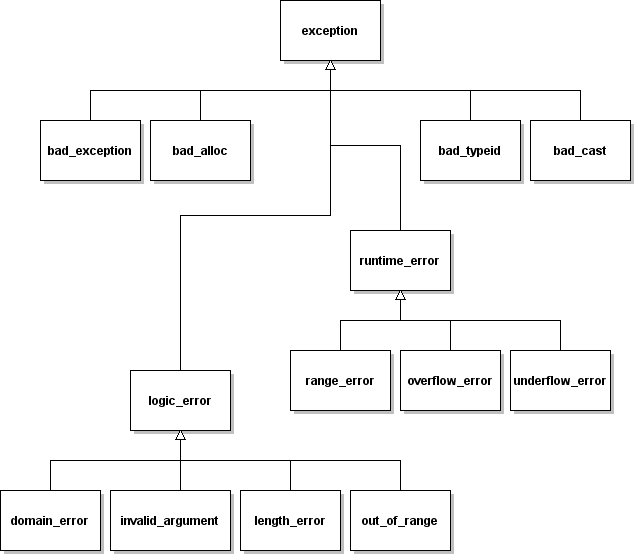

# [Exceptions](TheorieExceptionsOperateurs "wikilink")

\_\_FORCETOC\_\_

## Motivation

Dans un programme complet et opérationnel, une large part du code est consacrée au traitement des erreurs, et les instructions correspondantes ont souvent tendance à obscurcir le reste du code. Pour pallier à ce problème, le C++ propose le concept des exceptions logicielles.

## Mécanisme

Quand des erreurs d'éxécution sont possibles dans un bloc d'instructions, on peut le faire précéder du mot-clé `"try"`, et suivre d'un ou plusieurs blocs d'instructions chargés de gérer les éventuelles erreurs. Chacun de ces blocs, précédé du mot-clé `"catch"`, est capable de traiter une certaine sorte d'exceptions.

``` cpp
...
try
 {
  ...
 }
catch( char const * texte )
 {
  ...
 }
catch( int code_erreur )
 {
  ...
 }
...
```

A chaque emplacement du programme ou on détecte une anomalie, on peut **lancer une exception**. On peut lancer un objet du type de son choix, type prédéfini ou classe. Les blocs `"try"` et `"catch"` ne sont pas nécessairement aux mêmes endroit que les instructions `"throw"` (ils le sont même rarement).

``` cpp
...
if (valeur>valeur_max_autorisee)
 {
  throw "valeur trop grande" ;
 }
...
```

Lorsqu'une exception est lancée, le déroulement normal du programme est alors interrompu, et on sort successivement de toutes les fonctions et blocs d'instructions en cours, jusqu'à remonter à un bloc `"try"` possédant un gestionnaire d'exception (bloc `"catch"`) capable de traiter le type d'objet qui a été lancé.

``` cpp
#include <iostream>

class Dizaine
 {
  public :
    double element( unsigned int i )
     {
      if (i>=10) { throw "indice incorrect" ; }
      return valeurs_[i] ;
     }
    void change_element( unsigned int i, double d )
     {
      if (i>=10) { throw "indice incorrect" ; }
      valeurs_[i] = d ;
     }
  private :
    double valeurs_[10] ;
 } ;

void initialise( Dizaine & dizaine )
 {
  try
   {
    unsigned int i ;
    for ( i=0 ; i<=10 ; i++ )
     { dizaine.change_element(i,0) ; }
   }
  catch( char const * texte )
   { std::cout << "Probleme dans initialise : " << texte << std::endl ; }
 }

void affiche( Dizaine & dizaine )
 {
  std::cout << "[" << dizaine.element(0) ;
  unsigned int i ;
  for ( i=1 ; i<=10 ; i++ )
   { std::cout << "|" << dizaine.element(i) ; }
  std::cout << "]" << std::endl ;
 }

int main()
 {
  try
   {
    Dizaine dz ;
    initialise(dz) ;
    dz.change_element(3,24) ;
    affiche(dz) ;
    return 0 ;
   }
  catch( char const * texte )
   {
    std::cout << "Probleme dans main : " << texte << std::endl ;
    return 1 ;
   }
 }
```

## Exceptions Standards : classe de base

La class `exception`, définie dans le fichier de même nom, sert de classe de base à toutes les exceptions lancées par les éléments de la bibliothèque standard.

``` cpp
class exception
 {
  public:
    exception() ;
    exception( exception const & ) ;
    exception & operator=( exception const & ) ;
    virtual ~exception() ;
    virtual char const * what() const ;
  } ;
```

Attraper les exceptions de ce type permet donc d'intercepter toutes les exceptions lancées par les éléments de la bibliothèque standard.

``` cpp
#include <iostream>
#include <exception>

int main ()
 {
  try
   {
    ...
    return 0 ;
   }
  catch ( std::exception & e )
   {
    std::cerr<<"exception : "<<e.what()<<std::endl ;
    return 1 ;
   }
}
```

## Exceptions Standards : classes dérivées

Elles sont définies dans le fichier `exception`. Certaines sont réservées à des usages prédéfinis, notamment `bad_alloc` qui est lancée par l'opérateur `new` quand il échoue à allouer de la mémoire.



Les classes dérivées de `logic_error` et `runtime_error` peuvent aussi être utilisées dans vos programmes :

``` cpp
#include <iostream>
#include <exception>

class Dizaine
 {
  public :
    double element( unsigned int i )
     {
      if (i>=10) { throw std::out_of_range("indice incorrect") ; }
      return valeurs_[i] ;
     }
    void change_element( unsigned int i, double d )
     {
      if (i>=10) { throw std::out_of_range("indice incorrect") ; }
      valeurs_[i] = d ;
     }
  private :
    double valeurs_[10] ;
 } ;

...
```

  
  
© *CNRS 2015*  
*Assemblé et rédigé par David Chamont, cette œuvre est mise à disposition selon les termes de la [Licence Creative Commons - Attribution - Pas d’Utilisation Commerciale - Partage dans les Mêmes Conditions 4.0 International](http://creativecommons.org/licenses/by-nc-sa/4.0/)*
