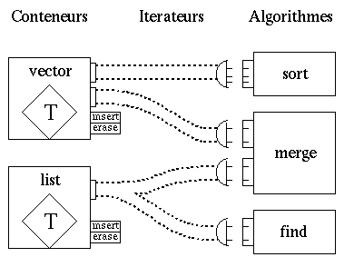

# [Les conteneurs historiques de bibliothèque standard](TheorieBonnesPratiquesBiblio "wikilink")

\_\_FORCETOC\_\_

## Généralités

#### Caractéristiques

**Alexander Stepanov** a établi les fondements de la **programmation générique** et développé la **STL**, une bibliothèque de **structures de données** et d**'algorithmes** dont la spécificité réside dans :

  - le découplage des données et des algorithmes,
  - la prise en compte des types prédéfinis,
  - le contrôle de la complexité.

L'implémentation en C++ à l'aide de **templates** permet de disposer de composants logiciels **réutilisables** sans sacrifier les **performances** d'éxécution.

#### Composants de la STL

  - **`conteneurs`** : collections d'objets.
  - **`itérateurs`** : généralisation des pointeurs.
  - **`algorithmes`** : manipulent les conteneurs à travers les itérateurs.

<!-- end list -->

  - **`objets-fonctions`** : généralisation des fontions.
  - **`adaptateurs`** : pour adapter les interfaces.
  - **`allocateurs`** : pour gérer la mémoire.

#### Connections dans la STL



#### Exemple

``` cpp
#include <iostream>
#include <list>
#include <algorithm>

...
void trie_liste( std::list<int> conteneur )
 {
  std::list<int>::iterator iterateur_debut = conteneur.begin() ;
  std::list<int>::iterator iterateur_fin = conteneur.end() ;
  std::sort(iterateur_debut,iterateur_fin) ;
 }
...
void affiche_liste( std::list<int> conteneur )
 {
  std::list<int>::iterator iterateur_debut = conteneur.begin() ;
  std::list<int>::iterator iterateur_fin = conteneur.end() ;
  std::list<int>::iterator iterateur ;
  for ( iterateur=iterateur_debut ; iterateur!=iterateur_fin ; iterateur++ )
   {
    std::cout<<*iterateur<<std::endl ;
   }
 }
...
```

## STL - Conteneurs

#### Fonctionnalités communes à tous les conteneurs STL

  - Construction vide, par copie intégrale, affectation, ou par itérateurs.
  - Destruction d'un conteneur avec destruction de tous ses éléments.
  - Comparaison par `==`, `!=`, `<`, `...`.
  - Fourniture d'itérateurs de tête et de fin (`begin()`, `end()`, `rbegin()`, `rend()`).

#### Séquences

Fonctionnalités spécifiques aux séquences

  - Construction d'une séquence en répétant plusieurs un objet ou une valeur par défaut.
  - Insertion par copie et suppression à une position quelconque, y compris en début et en fin de séquence.

Types de séquences les plus connus :

  - `T a[n]` : tableau classique du C/C++.
  - `vector`<T> : optimisé pour l'ajout ou la suppression d'éléments à la fin du conteneur, et l'accès direct à n'importe quel élément du conteneur.
  - `list`<T> : optimisé pour l'ajout ou la suppression d'éléments n'importe où, et un parcours itératif des éléments.

Les différents types de séquences n'ont aucun lien d'héritage les uns avec les autres. Par convention, on les regroupe dans une même famille parce qu'ils offrent les mêmes fonctionnalités, mais du point de vue du C++ il s'agit de types parfaitement indépendants.

#### Associations

Fonctionnalités spécifiques aux associations

  - Tri interne automatique des éléments.
  - Insertion, suppression et recherche par clé.
  - Itérateurs d'accès bidirectionnels.

Types de séquences les plus connus :

  - `set`<Key>
  - `map<Key,T>`

#### Exemple

``` cpp
#include <iostream>
#include <vector>
#include <cstddef>  // for std::size_t

int main()
 {
  std::vector<int> v ;
  
  // remplissage
  v.push_back(1) ;
  v.push_back(2) ;
  v.push_back(3) ;
  
  // relecture
  std::size_t i, size = v.size() ;
  for ( i=0 ; i<size ; i++ )
   { std::cout << v[i] << std::endl ; }
 }
```

## STL - Itérateurs

#### Itérateurs séquentiels unidirectionnels

Ils disposent des fonctionnalités d'un pointeur classique, à ceci près que l'on ne peut les déplacer qu'en avant et d'une case à la fois.

  - Accès : `* ->`
  - Comparaison : `== !=`
  - Déplacement : `++`

Exemple d'utilisation :

``` cpp
#include <iostream>
#include <vector>

int main()
 {
  std::vector<int> v ;
  
  // remplissage
  v.push_back(1) ;
  v.push_back(2) ;
  v.push_back(3) ;
  
  // affichage
  std::vector<int>::iterator itr ;
  for ( itr=v.begin() ; itr!=v.end() ; itr++ )
   { std::cout << *itr << std::endl ; }
 }
```

#### Itérateurs séquentiels bidirectionnels

Ils ajoutent aux itérateurs unidirectionnels l'opérateur de décrémentation afin de pouvoir circuler dans les deux sens au sein du conteneur :

  - Déplacement : `--`

#### Itérateurs à accès direct

De tels itérateurs, en plus des fonctionnalités des itérateurs séquentiels bidirectionnels, ajoutent toutes celles qui transforment le conteneur sous-jacent en tableau et l'itérateur en pointeur classique :

  - Accès : `[ ]`
  - Déplacement : `+= -= + -`
  - Comparaison : `< > <= >=`

## STL - Algorithmes

#### Algorithmes génériques

L'algorithme est une fonction paramétrée par le type des itérateurs passés en arguments. Une même fonctionnalité est généralement fournie avec plusieurs variantes, permettant notamment à l'utilisateur defournir ses propres prédicats de test ou sa propre fonction de comparaison.

``` cpp
template <class Iterator, class T>
Iterator find( Iterator first, Iterator last, T const & value ) ;
```

#### Algorithmes disponibles

Ne modifiants pas le conteneur

  - `find`, `search`, `count`, `for_each`, `equal`, `mismatch`

Modifiants le conteneur

  - `copy`, `fill`, `generate`
  - `partition`, `random_shuffle`, `reverse`, `rotate`
  - `remove`, `replace`, `transform`, `unique`
  - `swap`

Liés au tri

  - `sort`, `stable_sort`, `partial_sort`, `nth_element`
  - `binary_search`, `lower_bound`, `upper_bound`, `equal_range`
  - `merge`, `inplace_merge`
  - `includes`, `set_union`, `set_intersection`, `set_difference`, `set_symmetric_difference`
  - `make_heap`, `pop_heap`, `push_heap`, `sort_heap`
  - `min`, `max`, `lexicographical_compare`, `next_permutation`, `prev_permutation`

Numériques

  - `accumulate`, `partial_sum`, `adjacent_difference`, `inner_product`

#### Recherche dans un tableau

``` cpp
#include <algorithm>
#include <iostream>
#include <string>
int main()
 {
  std::vector<int> fibonacci = {0, 1, 1, 2, 3, 5};
  std::vector<int>::iterator where = std::find(fibonacci.begin(), fibonacci.end(), 3);
  if (where != fibonacci.end())
    std::cout << "Value found: " << *where << std::endl ;
  return 0 ;
 }
```

## STL - Discussions

#### STL et STD

La STL est un **sous-ensemble** de la bibliothèque C++ standard adoptée par le comité ANSI/ISO.

Cependant, elle constitue un **système cohérent**, **complet** et relativement **découplé** du reste de la bibliothèque standard.

#### STL et programmation structurée

On peut relever un retour à la scission entre données et algorithmes, telle qu'elle était pratiquée en programmation structurée, mais :

  - les données sont dotées de fonctions pour les manipuler,
  - les algorithmes peuvent posséder des paramètres internes,
  - le même algorithme est réutilisable avec plusieurs structures de données.

## STL - Etc

#### Objets-Fonctions

On qualifie d**'objet-fonction** l'instance d'une classe qui définit l'opérateur `( )`. La STL utilise de tels objets à la place des pointeurs de fonctions afin de permettre une implémentation en ligne de la fonction. Des classes paramétrées sont fournies, qui permettent d'encapsuler les opérateurs les plus courants.

  - `plus`<T>, `minus`<T>, `times`<T>, `divides`<T>
  - `modulus`<T>, `negate`<T>
  - `equal_to`<T>, `not_equal_to`<T>
  - `greater`<T>, `less`<T>, `greater_equal`<T>, `less_equal`<T>
  - `logical_and`<T>, `logical_or`<T>, `logical_not`<T>

#### Adaptateurs

  - `reverse_iterator< C`<T>`::iterator >`
  - `reverse_bidirectionnal_iterator< C`<T>`::iterator >`
  - `stack< C`<T>` >`
  - `queue< C`<T>` >`
  - `priority_queue< C`<T>` >`
  - `not1`<Predicate>, `not2<P1,P2>`
  - `bind1st<Predicate,T>`, `bind2nd<Predicate,T>`
  - `pointer_to_unary_functions<Argument,Result>`, `pointer_to_binary_functions<Arg1,Arg2,Result>`

  
  
© *CNRS 2015*  
*Assemblé et rédigé par David Chamont, cette œuvre est mise à disposition selon les termes de la*  
*[Licence Creative Commons - Attribution - Pas d’Utilisation Commerciale - Partage dans les Mêmes Conditions 4.0 International](http://creativecommons.org/licenses/by-nc-sa/4.0/)*
