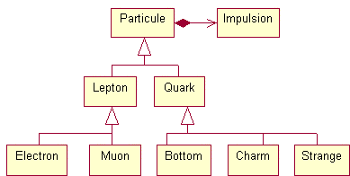

# [Héritage & polymorphisme](TheorieObjets "wikilink")

\_\_FORCETOC\_\_

## Motivation : classification des types

Dans la théorie des types, comme dans les théories de la connaissance en général, on éprouve le besoin d'exprimer non seulement la notion de "contenance", mais aussi la notion de "sorte".



## Héritage Public

#### Héritage public

Lorsqu'une classe hérite d'une autre, elle récupère les attributs et les méthodes de cette dernière.

``` cpp
#include <iostream>

class Particule
 {
  public  :
    void change_masse( double masse ) { masse_ = masse ; }
    double masse() { return masse_ ; }
  private  :
    double masse_ ;
 } ;

class ParticuleNonChargee : public Particule
 {
 } ;

int main()
 {
  ParticuleNonChargee p ;
  p.change_masse(1) ;
  std::cout << "masse = " << p.masse() << std::endl ;         
  return 0 ;
 }
```

#### Extension de la classe

On peut profiter de l'héritage pour ajouter de nouveaux attributs et de nouvelles méthodes à la classe dérivée.

``` cpp
#include <iostream>

class Particule
 {
  public  :
    void change_masse( double masse ) { masse_ = masse ; }
    double masse() { return masse_ ; }
  private  :
    double masse_ ;
 } ;

class ParticuleChargee : public Particule
 {
  public  :
    void change_charge( double charge ) { charge_ = charge ; }
    double charge() { return charge_ ; }
  private  :
    double charge_ ;
 } ;

int main()
 {
  ParticuleChargee p ;
  p.change_masse(1) ;
  p.change_charge(1) ;
  std::cout << "masse = " << p.masse() << std::endl ;         
  std::cout << "charge = " << p.charge() << std::endl ;         
  return 0 ;
 }
```

#### Surcharge de méthode

Lors d'un héritage, on peut également redéfinir le corps d'une ou plusieurs méthodes.

``` cpp
#include <iostream>
#include <string>

class Particule
 {
  public  :
    std::string nom() { return "Particule" ; }
    void change_masse( double masse ) { masse_ = masse ; }
    double masse() { return masse_ ; }
  private  :
    double masse_ ;
 } ;

class ParticuleNonChargee : public Particule
 {
  public :
    std::string nom() { return "ParticuleNonChargee" ; }
 } ;

class ParticuleChargee : public Particule
 {
  public  :
    std::string nom() { return "ParticuleChargee" ; }
    void change_charge( double charge ) { charge_ = charge ; }
    double charge() { return charge_ ; }
  private  :
    double charge_ ;
 } ;

int main()
 {
  std::string rep ;
  std::cout << "particule chargee ? " ;           
  std::cin >> rep ;           
  if (rep=="oui")
   {
    ParticuleChargee p1 ;
    p1.change_masse(1) ;
    p1.change_charge(1) ;
    std::cout << p1.nom() << std::endl ;          
    std::cout << "masse = " << p1.masse() << std::endl ;         
    std::cout << "charge = " << p1.charge() << std::endl ;         
   }
  else
   {
    ParticuleNonChargee p2 ;
    p2.change_masse(2) ; 
    std::cout << p2.nom() << std::endl ;          
    std::cout << "masse = " << p2.masse() << std::endl ;         
   }
  return 0 ;
 }
```

## Polymorphisme

#### Arguments par valeur

Si B hérite de A, on peut fournir un objet de classe B à une fonction qui attend un objet classe A. La fonction travaille alors sur une copie de la sous-partie A de l'objet.

``` cpp
#include <iostream>
#include <string>

class Particule
 {
  public  :
    std::string nom() { return "Particule" ; }
    void change_masse( double masse ) { masse_ = masse ; }
    double masse() { return masse_ ; }
  private  :
    double masse_ ;
 } ;

class ParticuleNonChargee : public Particule
 {
  public :
    std::string nom() { return "ParticuleNonChargee" ; }
 } ;

class ParticuleChargee : public Particule
 {
  public  :
    std::string nom() { return "ParticuleChargee" ; }
    void change_charge( double charge ) { charge_ = charge ; }
    double charge() { return charge_ ; }
  private  :
    double charge_ ;
 } ;

void affiche( Particule p  )
 {
  std::cout << p.nom() << endl ;          
  std::cout << "masse = " << p.masse() << std::endl ;         
 }

int main()
 {
  std::string rep ;
  std::cout << "particule chargee ? " ;           
  std::cin >> rep ;           
  if (rep=="oui")
   {
    ParticuleChargee p1 ;
    p1.change_masse(1) ;
    p1.change_charge(1) ;
    affiche(p1) ;
    std::cout << "charge = " << p1.charge() << std::endl ;         
   }
  else
   {
    ParticuleNonChargee p2 ;
    p2.change_masse(2) ; 
    affiche(p2) ;
   }
  return 0 ;
 }
```

#### Arguments par référence

Si B hérite de A, on peut fournir un objet de classe B à une fonction qui attend un objet classe A par référence ou pointeur. La fonction travaille alors directement sur la sous-partie A de l'objet.

``` cpp
#include <iostream>
#include <string>

class Particule
 {
  public  :
    std::string nom() { return "Particule" ; }
    void change_masse( double masse ) { masse_ = masse ; }
    double masse() { return masse_ ; }
  private  :
    double masse_ ;
 } ;

class ParticuleNonChargee : public Particule
 {
  public :
    std::string nom() { return "ParticuleNonChargee" ; }
 } ;

class ParticuleChargee : public Particule
 {
  public  :
    std::string nom() { return "ParticuleChargee" ; }
    void change_charge( double charge ) { charge_ = charge ; }
    double charge() { return charge_ ; }
  private  :
    double charge_ ;
 } ;

void init( Particule & p, double masse  )
 { p.change_masse(masse) ; }

void affiche( Particule p  )
 {
  std::cout << p.nom() << endl ;          
  std::cout << "masse = " << p.masse() << std::endl ;         
 }

int main()
 {
  std::string rep ;
  std::cout << "particule chargee ? " ;           
  std::cin >> rep ;           
  if (rep=="oui")
   {
    ParticuleChargee p1 ;
    init(p1,1) ; 
    p1.change_charge(1) ; 
    affiche(p1) ;
    std::cout << "charge = " << p1.charge() << std::endl ;         
   }
  else
   {
    ParticuleNonChargee p2 ;
    init(p2,2) ; 
    affiche(p2) ;
   }
  return 0 ;
 }
```

#### Liaison statique

Par défaut, C++ résoud les appels de méthodes lors de la compilation, en se fondant sur le type de la variable, même lorsqu'elle est polymorphe.

``` cpp
#include <iostream>
#include <string>

class Particule
 {
  public  :
    std::string nom() { return "Particule" ; }
    void change_masse( double masse ) { masse_ = masse ; }
    double masse() { return masse_ ; }
  private  :
    double masse_ ;
 } ;

class ParticuleNonChargee : public Particule
 {
  public :
    std::string nom() { return "ParticuleNonChargee" ; }
 } ;

class ParticuleChargee : public Particule
 {
  public  :
    std::string nom() { return "ParticuleChargee" ; }
    void change_charge( double charge ) { charge_ = charge ; }
    double charge() { return charge_ ; }
  private  :
    double charge_ ;
 } ;

void init( Particule & p, double masse  )
 { p.change_masse(masse) ; }

void affiche( Particule & p  )
 {
  std::cout << p.nom() << std::endl ;          
  std::cout << "masse = " << p.masse() << std::endl ;         
 }

int main()
 {
  std::string rep ;
  std::cout << "particule chargee ? " ;           
  std::cin >> rep ;           
  if (rep=="oui")
   {
    ParticuleChargee p1 ;
    init(p1,1) ; 
    p1.change_charge(1) ; 
    affiche(p1) ;
    std::cout << "charge = " << p1.charge() << std::endl ;         
   }
  else
   {
    ParticuleNonChargee p2 ;
    init(p2,2) ; 
    affiche(p2) ;
   }
  return 0 ;
 }
```

#### Liaison dynamique

Lorsqu'une méthode est virtuelle, la résolution des appels à cette méthode est faite lors de l'éxécution du programme, selon la classe réelle de l'objet à qui on applique la méthode.

``` cpp
#include <iostream>
#include <string>

class Particule
 {
  public  :
    virtual std::string nom() { return "Particule" ; }
    void change_masse( double masse ) { masse_ = masse ; }
    double masse() { return masse_ ; }
  private  :
    double masse_ ;
 } ;

class ParticuleNonChargee : public Particule
 {
  public :
    virtual std::string nom() { return "ParticuleNonChargee" ; }
 } ;

class ParticuleChargee : public Particule
 {
  public  :
    virtual std::string nom() { return "ParticuleChargee" ; }
    void change_charge( double charge ) { charge_ = charge ; }
    double charge() { return charge_ ; }
  private  :
    double charge_ ;
 } ;

void init( Particule & p, double masse  )
 { p.change_masse(masse) ; }

void affiche( Particule & p  )
 {
  std::cout << p.nom() << endl ;          
  std::cout << "masse = " << p.masse() << std::endl ;         
 }

int main()
 {
  std::string rep ;
  std::cout << "particule chargee ? " ;           
  std::cin >> rep ;           
  if (rep=="oui")
   {
    ParticuleChargee p1 ;
    init(p1,1) ;
    p1.change_charge(1) ;
    affiche(p1) ;
    std::cout << "charge = " << p1.charge() << std::endl ;         
   }
  else
   {
    ParticuleNonChargee p2 ;
    init(p2,2) ;
    affiche(p2) ;
   }
  return 0 ;
 }
```

#### Objets sur le tas

Notons que l'on peut également créer nos objets sur le tas, comme n'importe quelle variable.

``` cpp
#include <iostream>
#include <string>

class Particule
 {
  public  :
    virtual std::string nom() { return "Particule" ; }
    void change_masse( double masse ) { masse_ = masse ; }
    double masse() { return masse_ ; }
  private  :
    double masse_ ;
 } ;

class ParticuleNonChargee : public Particule
 {
  public :
    virtual std::string nom() { return "ParticuleNonChargee" ; }
 } ;

class ParticuleChargee : public Particule
 {
  public  :
    virtual std::string nom() { return "ParticuleChargee" ; }
    void change_charge( double charge ) { charge_ = charge ; }
    double charge() { return charge_ ; }
  private  :
    double charge_ ;
 } ;

void init( Particule * p, double masse  )
 { p->change_masse(masse) ; }

void affiche( Particule * p  )
 {
  std::cout << p->nom() << std::endl ;          
  std::cout << "masse = " << p->masse() << std::endl ;         
 }

int main()
 {
  std::string rep ;
  Particule * p ;
  std::cout << "particule chargee ? " ;           
  std::cin >> rep ;           
  if (rep=="oui")
   {
    p = new ParticuleChargee ;
    p->change_charge(1) ;
    p->change_masse(1) ;
    affiche(p) ;
    std::cout << "charge = " << p->charge() << std::endl ;         
   }
  else
   {
    p = new ParticuleNonChargee ;
    p->change_masse(2) ;
    affiche(p) ;
   }
  delete p ;
  return 0 ;
 }
```

#### Forçage de type par `dynamic_cast`

La laison dynamique ne suffit pas toujours. Parfois, un objet est référencé par une variable de type pointeur ou référence vers une classe de base `A`, mais notre connaissance du programme nous permet de connaitre à coup sur que la vraie classe dérivée de l'objet est `B`, et nous souhaitons accéder à des méthodes additionnelles qui ne sont définies que dans la classe dérivée.

Plutôt que de forcer directement le type du pointeur, comme on le ferait en C (`(B*)pointeur`), il est préconisé d'utiliser un `dynamic_cast<B*>(pointeur)`. Cette dernière technique vérifie que l'objet pointé est bien du type prescrit. Dans le cas contraire, si on est entrain de forcer un pointeur, le résultat est nul. Si on est en train de forcer une référence, une exception est émise.

``` cpp
#include <iostream>

class Mere {
 public:
  virtual void bonjour() { std::cout << "Bonjour !" << std::endl; }
};

class Fille: public Mere {
  int age;
};

int main()
 {
  Mere  * a = new Mere ;
  Fille * b = new Fille ; 
  Fille * c ;
  Mere  * d ;

  c = static_cast<Fille*>(a);
  if (c == nullptr) std::cout << "Fille - Conversion statique impossible" << std::endl;

  c = dynamic_cast<Fille*>(a);
  if (c == nullptr) std::cout << "Fille - Conversion dynamique impossible" << std::endl;

  d = static_cast<Mere*>(b);
  if (d == nullptr) std::cout << "Mere - Conversion statique impossible" << std::endl;

  d = dynamic_cast<Mere*>(b);
  if (d == nullptr) std::cout << "Mere - Conversion dynamique impossible" << std::endl;
}
```

    #!txt
    Fille - Conversion dynamique impossible

  
  
© *CNRS 2016*  
*Assemblé et rédigé par David Chamont, cette œuvre est mise à disposition selon les termes de la [Licence Creative Commons - Attribution - Pas d’Utilisation Commerciale - Partage dans les Mêmes Conditions 4.0 International](http://creativecommons.org/licenses/by-nc-sa/4.0/)*
