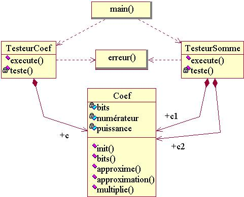

# [TP : Classes & Objets](README.md)

\_\_FORCETOC\_\_

Ici, on revoit le code pour y introduire des objets et des classes. Aucune des modifications effectuées dans cette page n'est censée modifier les affichages du programme.\\\\ Il est conseillé de partir du fichier [tp1\_variables\_fonctions.cpp](coefs-old/tp1_variables_fonctions.cpp.md). Si vous êtes sous linux, vous pouvez utilisez le script [tp1\_variables\_fonctions.sh](coefs-old/tp1_variables_fonctions.sh.md) qui va compiler le programme, l'éxécuter et finalement signaler si ses affichages ont été modifiés. Pour préparer les affichages qui serviront de référence, éxécutez le script une première fois et tapez `cp tp1_variables_fonctions.log tp1_variables_fonctions.ref`.\\\\ Accès à la [section théorique correspondante](FondamentauxClassesObjets.md).

## 1\) Regroupement du numérateur et de l'exposant associé dans une classe Coef

Créez la classe `Coef`, qui représente un nombre réel sous la forme d'un numérateur entier divisé par une puissance de deux. Dotez la classe de deux variables membres entières publiques nommées `numerateur_` et `exposant_`. Modifiez `approxime(...)` pour qu'elle manipule un objet de type `Coef` au lieu d'agir sur deux entiers passés par référence. Les fonctions `teste_approxime(...)` et `multiplie(...)` doivent être corrigées en conséquence. La déclaration d'`approxime(...)` doit être :

``` cpp
void approxime( int bits, double valeur, Coef & coef )
 {
  ...
```

## 2\) Retourner un Coef

Modifiez à nouveau `approxime(...)` pour qu'elle retourne un objet de type `Coef` au lieu d'agir sur une référence. Les fonctions `teste_approxime(...)` et `multiplie(...)` doivent être elles aussi corrigées. La nouvelle déclaration d'`approxime(...)` doit être :

``` cpp
Coef approxime( int bits, double valeur )
 {
  ...
```

## 3\) Masquage des variables membres de Coef et rattachement des fonctions

Placez les variables membres `numerateur_` et `exposant_` de Coef dans une section privée. En conséquence, toutes les fonctions qui ont besoin de manipuler directement `numerateur_` et `exposant_` doivent devenir des fonctions membre de Coef, ou sous-traiter ces manipulations à de nouvelle fonctions membres de Coef. Attention, les trois points ci-dessous doivent être traités avant de pouvoir à nouveau compiler :

  - Transformez `approxime(...)` en fonction membre publique de `Coef`. Elle n'est alors plus censée retourner un Coef comme résultat, mais agir directement sur l'objet de type Coef pour lequel elle a été invoquée : `*this`. Corrigez `teste_approxime(...)`.

<!-- end list -->

  - Ajoutez une nouvelle fonction membre `approximation(...)`, qui retourne la valeur réelle égale à `numerateur_/2^exposant_^`. Corrigez `teste_approxime(...)` pour utiliser cette nouvelle fonction membre.

<!-- end list -->

  - Transformez `multiplie(...)` en fonction membre publique de `Coef`. Au lieu de lui passer le nombre de bits et le coefficient réel en tant qu'arguments, supprimez ces arguments et faite en sorte que `multiplie(...)` utilise directement les valeurs déjà disponibles dans les variables membres `numerateur_` et `exposant_` de l'objet courant. Les utilisateurs, au lieu d'appeler `multiplie(bits,reel,entier)`, sont maintenant censés appeler d'abord `approxime(bits,reel)`, pour que `numerateur_` et `exposant_` soit préparés, puis appeler `multiplie(entier)`. Dans le cas de `teste_somme(...)`, cela donne :

<!-- end list -->

``` cpp
void teste_somme( int bits, double reel1, int entier1, double reel2, int entier2 )
 {
  Coef c1, c2 ;
  c1.approxime(bits,reel1) ;
  c2.approxime(bits,reel2) ;
  int approx = c1.multiplie(entier1) + c2.multiplie(entier2) ;
  ...
```

## 4\) Création de la première classe de test \!TesteurCoef

Créez la classe `TesteurCoef` chargée de tester la précision de la classe `Coef` pour les valeurs **0.65** et **0.35**. Elle aura les membres suivant :

  - une fonction privée `teste(...)`, copie conforme de `teste_approxime(...)` ;
  - une fonction publique `execute(...)`, avec en argument le nombre de bits souhaité, et qui invoque la fonction ci-dessus pour les valeurs **0.65** puis **0.35**.

Supprimez la fonction `teste_approxime(...)`, remplacée par la classe `TesteurCoef`. On doit également adapter le programme principal en remplacant l'appel à la fonction `teste_approxime(...)` par la définition d'un objet de type `TesteurCoef` et un appel à sa fonction membre `execute(...)` :

``` cpp
int main()
 {
  int bits ;

  std::cout<<std::endl ;
  TesteurCoef tc ;
  for ( bits = 2 ; bits <= 8 ; bits = bits + 2 )
   { tc.execute(bits) ; }

  std::cout<<std::endl ;
  for ( bits = 1 ; bits <= 8 ; bits = bits + 1 )
   { teste_somme(bits,0.65,3515,0.35,4832) ; }

  std::cout<<std::endl ;
  return 0 ;
 }
```

## 5\) Intégration du nombre de bits dans Coef

Ajoutez à `Coef` une variable membre privée entiere appelée `bits_`, censée représenter le nombre de bits à utiliser lors des appels à `approxime(...)`. Ajouter une fonction membre `void init( int bits )` qui permet à un utilisateur extérieur de Coef de changer la valeur de `bits_`, et une fonction membre `int lit_bits()` qui permet à un utilisateur extérieur de Coef de lire la valeur courante de `bits_`.

Supprimez le premier argument de `approxime(...)`, et modifier cette fonction pour qu'elle utilise `bits_` à la place. Les utilisateurs, au lieu d'appeler `approxime(bits,reel)`, sont maintenant censés appeler d'abord `init(bits)` puis `approxime(reel)`. Dans le cas de `TesteurCoef::teste(...)`, cela donne :

``` cpp
class TesteurCoef
 {
  ...
    void teste( int bits, double valeur )
     {
      Coef c ;
      c.init(bits) ;
      c.approxime(valeur) ;
      ...
```

## 6\) Insertion d'une instance de Coef dans \!TesteurCoef

Ajoutez à la classe `TesteurCoef` un objet membre privé `c_` de type `Coef` et utilisez cet objet dans la fonction `teste`. Initialisez le nombre de bits de `c_` au début de la fonction membre `execute` et supprimez l'argument `bits` de `teste(...)`, devenu inutile.

## 7\) Création du deuxième testeur \!TesteurSomme

Créez la classe `TesteurSomme` chargée de tester le calcul de **0.65\*3515 + 0.35, 4832**. Elle aura les membres suivant :

  - deux objets membres privés `c1_` et `c2_` de type `Coef` ;
  - une fonction membre privée `teste`, inspirée de `teste_somme()` mais en supprimant l'argument `bits` ;
  - une fonction publique `execute`, avec en argument le nombre de bits souhaités, qui initialise `c1_` et `c2_` puis invoque la fonction `teste` :

<!-- end list -->

``` cpp
class TesteurSomme
 {
  public :
    void execute( int bits )
     {
      c1_.init(bits) ;
      c2_.init(bits) ;
      teste(0.65,3515,0.35,4832) ;
     }
    ...
```

Modifiez le programme principal en remplacant l'appel à la fonction `teste_somme(...)` par la définition d'un objet de type `TesteurSomme` et un appel à sa fonction membre `execute(...)`. Supprimez l'ancienne fonction `teste_somme(...)`.

## 8\) Factorisation du calcul et de l'affichage de l'erreur

Créez la fonction `erreur(...)` qui calcule et affiche le taux d'erreur entre un nombre réel et son approximation, sur une échelle entière allant de 0 à un indice maximum donné. Les arguments d'entrée sont :

  - le nombre de bits utilisés lors de l'approximation,
  - le nombre réel exact et son approximation,
  - la largeur d'affichage de l'approximation,
  - l'indice maximum d'erreur.

La fonction doit afficher sur une ligne : le nombre de bits, le nombre réel exact, son approximation, l'indice d'erreur et l'indice maximum. Corrigez les fonctions `teste(...)` de `TesteurCoef` et `TesteurSomme` pour qu'elles utilisent la nouvelle fonction.

## \*) Diagramme de classes UML de la solution



## 9\) Création du Testeur de base

Ecrivez la classe `Testeur`, chargée de gérer le calcul d'erreur de tous les testeurs. Ses membres sont les suivants :

  - un attribut privé `resolution_` correspondant à la précision d'affichage du taux d'erreur ;
  - une méthode publique `init` avec un argument dont la valeur est recopiée dans `resolution_` ;
  - une méthode publique `erreur`, copie conforme de la fonction de même nom mis à part qu'elle utilise l'attribut `resolution_` au lieu d'un argument.

Supprimez l'ancienne fonction `erreur`. Faites hériter `TesteurCoef` et `TesteurSomme` de la classe `Testeur`. Corrigez les méthodes `teste` et ajoutez dans le programme principal l'initialisation de l'indice maximum de chaque testeur utilisé.

## 10\) Utilisation du Testeur

Ecrivez une nouvelle fonction `boucle`, dont les arguments sont un objet de type `Testeur`, la résolution, un nombre de bits initial, un nombre final et un incrément. La fonction doit afficher un saut de ligne puis initialiser la résolution du testeur et exécuter ce dernier pour la série de nombre de bits donnée en arguments (ce que fait actuellement le programme principal).

` `*`Le`` ``testeur`` ``doit`` ``être`` ``passé`` ``à`` ``la`` ``fonction`` ``par`` ``référence.`*`\\`  
` `*`La`` ``classe`` ``Testeur`` ``doit`` ``être`` ``dotée`` ``d'une`` ``méthode`` ``execute(...)`` ``virtuelle.`*

Remplacez les boucles du programme principal par des appels à la fonction `boucle`. Pour l'appel concernant un objet de type `TesteurCoef`, demandez une résolution de 1000000 et un nombre de bits allant de 4 à 16 par pas de 4. Le `main(...)` final est :

``` cpp
int main()
 {
  TesteurCoef tc ;
  TesteurSomme ts ;
  boucle(tc,1000000,4,16,4) ;
  boucle(ts,1000,1,8,1) ;
  std::cout << std::endl ;
  return 0 ;
 }
```

## \*) Question Bonus

Le compilateur traite un fichier de haut en bas. A chaque fois qu'un type, une classe, une fonction est utilisée, il faut qu'elle est été définie avant, c'est à dire plus haut dans le fichier.

Pour chacune des classes et fonctions de votre programme, essayez de les remonter le plus haut possible dans le fichier, jusqu'à obtenir un ordonnancement idéal, commençant par les fonctions/classes les plus réutilisées, et finissant par les fonctions/classes qui utilisent le plus les autres.

## \*) Diagramme de classes UML de la solution finale


© *[David Chamont](http://llr.in2p3.fr/spip.php?page=view_person&personID=121), Laboratoire Leprince-Ringuet (LLR) / IN2P3 / CNRS, Ecole polytechnique / Université Paris-Saclay*\\\\ © *Ce(tte) œuvre est mise à disposition selon les termes de la [Licence Creative Commons Attribution - Partage dans les Mêmes Conditions 4.0 International](http://creativecommons.org/licenses/by-sa/4.0/)*
