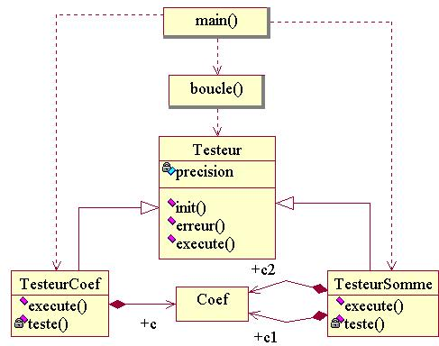

# [TP : Héritage & Polymorphisme](README.md.md) \[\#license ©\]

\_\_FORCETOC\_\_

Maintenant, les concepts qui font de C++ un langage "orienté objet".\\\\ Il est conseillé de partir du fichier [tp2\_classes\_objets.cpp](coefs-old/tp2_classes_objets.cpp.md). Si vous êtes sous linux, vous pouvez utilisez le script [tp2\_classes\_objets.sh](coefs-old/tp2_classes_objets.sh.md) qui va compiler le programme, l'éxécuter et finalement signaler si ses affichages ont été modifiés.\\\\ Accès à la [section théorique correspondante](FondamentauxHeritagePolymorphisme.md).

## 1\) Création du Testeur de base

Ecrivez la classe `Testeur`, chargée de gérer le calcul d'erreur de tous les testeurs. Ses membres sont les suivants :

  - un attribut privé `resolution_` correspondant à la précision d'affichage du taux d'erreur ;
  - une méthode publique `init` avec un argument dont la valeur est recopiée dans `resolution_` ;
  - une méthode publique `erreur`, copie conforme de la fonction de même nom mis à part qu'elle utilise l'attribut `resolution_` au lieu d'un argument.

Supprimez l'ancienne fonction `erreur`. Faites hériter `TesteurCoef` et `TesteurSomme` de la classe `Testeur`. Corrigez les méthodes `teste` et ajoutez dans le programme principal l'initialisation de l'indice maximum de chaque testeur utilisé.

## 2\) Utilisation du Testeur

Ecrivez une nouvelle fonction `boucle`, dont les arguments sont un objet de type `Testeur`, la résolution, un nombre de bits initial, un nombre final et un incrément. La fonction doit afficher un saut de ligne puis initialiser la résolution du testeur et exécuter ce dernier pour la série de nombre de bits donnée en arguments (ce que fait actuellement le programme principal).

` `*`Le`` ``testeur`` ``doit`` ``être`` ``passé`` ``à`` ``la`` ``fonction`` ``par`` ``référence.`*`\\`  
` `*`La`` ``classe`` ``Testeur`` ``doit`` ``être`` ``dotée`` ``d'une`` ``méthode`` ``execute(...)`` ``virtuelle.`*

Remplacez les boucles du programme principal par des appels à la fonction `boucle`. Pour l'appel concernant un objet de type `TesteurCoef`, demandez une résolution de 1000000 et un nombre de bits allant de 4 à 16 par pas de 4. Le `main(...)` final est :

``` cpp
int main()
 {
  TesteurCoef tc ;
  TesteurSomme ts ;
  boucle(tc,1000000,4,16,4) ;
  boucle(ts,1000,1,8,1) ;
  std::cout << std::endl ;
  return 0 ;
 }
```

## \*) Question Bonus

Le compilateur traite un fichier de haut en bas. A chaque fois qu'un type, une classe, une fonction est utilisée, il faut qu'elle est été définie avant, c'est à dire plus haut dans le fichier.

Pour chacune des classes et fonctions de votre programme, essayez de les remonter le plus haut possible dans le fichier, jusqu'à obtenir un ordonnancement idéal, commençant par les fonctions/classes les plus réutilisées, et finissant par les fonctions/classes qui utilisent le plus les autres.

## \*) Diagramme de classes UML de la solution



© *[David Chamont](http://llr.in2p3.fr/spip.php?page=view_person&personID=121), Laboratoire Leprince-Ringuet (LLR) / IN2P3 / CNRS, Ecole polytechnique / Université Paris-Saclay*\\\\ © *Ce(tte) œuvre est mise à disposition selon les termes de la [Licence Creative Commons Attribution - Partage dans les Mêmes Conditions 4.0 International](http://creativecommons.org/licenses/by-sa/4.0/)*
