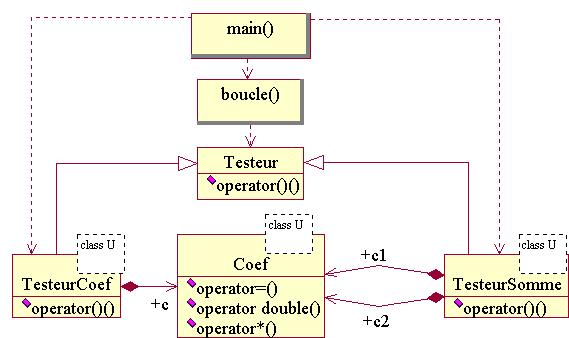

# [TP : Opérateurs & Templates](README.md) \[\#license ©\]

\_\_FORCETOC\_\_

Enfin, les deux fonctionnalités qui font de C++ un langage "plus qu'objet". Aucune des modifications effectuées dans cette page n'est censée modifier les affichages du programme.\\\\ Il est conseillé de partir du fichier [tp3\_heritage\_polymorphisme.cpp](coefs-old/tp3_heritage_polymorphisme.cpp.md). Si vous êtes sous linux, vous pouvez utilisez le script [tp3\_heritage\_polymorphisme.sh](coefs-old/tp3_heritage_polymorphisme.sh.md) qui va compiler le programme, l'éxécuter et finalement signaler si ses affichages ont été modifiés.\\\\ Accès à la [section théorique correspondante](FondamentauxOperateursTemplates.md).

## 1\) operator\*

Transformez la méthode `multiplie(...)` de la classe `Coef` en opérateur de multiplication.

` `*`L'opérateur`` ``de`` ``multiplication`` ``s'appelle`` ``"operator*"``.`*

Corrigez les méthodes `teste(...)`.

` `*`Quand`` ``une`` ``classe`` ``est`` ``dotée`` ``de`` ``cet`` ``opérateur,`` ``on`` ``peut`` ``écrire`` ``"obj1 * obj2"`` ``comme`` ``on`` ``le`` ``fait`` ``avec`` ``les`` ``types`` ``prédéfinis.`*

\== 2) operator=

Transformez la méthode `approxime` de la classe `Coef` en opérateur d'affectation.

` `*`L'opérateur`` ``d'affectation`` ``s'appelle`` ``"operator="``.`*

Corrigez les méthodes `teste`.

` `*`Quand`` ``une`` ``classe`` ``est`` ``dotée`` ``de`` ``cet`` ``opérateur,`` ``on`` ``peut`` ``écrire`` ``"obj1 = ..."`` ``comme`` ``on`` ``le`` ``fait`` ``avec`` ``les`` ``types`` ``prédéfinis.`*

## 3\) Coef<int>

Le type entier utilisé pour l'attribut `numerateur_` de la classe `Coef` a été choisi arbitrairement. Faites-en un paramètre de la classe.

` `*`Il`` ``faut`` ``ajouter`` ``"template`<typename U>`"`` ``avant`` ``la`` ``definition`` ``de`` ``classe,`` ``et`` ``remplacer`` ``par`` ``U`` ``le`` ``type`` ``de`` ``numerateur_``.`*

Corrigez les classes `TesteurCoef` et `TesteurSomme`.

` `*`A`` ``chaque`` ``utilisation`` ``de`` ``la`` ``classe`` ``Coef``,`` ``il`` ``faut`` ``ajouter`` ``entre`` ``<>`` ``le`` ``nom`` ``de`` ``type`` ``à`` ``substituer`` ``à`` ``U``.`*

## 4\) Ajustement de l'opérateur \*

On suppose que tous les entiers de notre simulation sont stockés avec une précision comparable. En particulier, les entiers de notre somme pondérée sont stockés de la même façon que les numérateurs de nos coefficients : dans la méthode `operator*` de la classe `Coef`, remplacez le type entier par le paramètre `U`.

## 5\) \!TesteurCoef<short>

On veut pouvoir tester la classe `Coef` avec des types entiers différents. Ajoutez un type paramétré aux classes `TesteurCoef` et `TesteurSomme`. Utilisez ce paramètre pour définir le type de leurs attributs.

Corrigez le programme principal pour qu'il utilise le type entier `short`.

## 6\) 1000000/1000000

Que remarquez-vous à l'éxécution ? Corrigez le programme principal pour qu'il utilise le type `unsigned short` pour l'objet de type `TesteurCoef`.

## 7\) Conversion en double

Transformez la méthode `approximation` de la classe `Coef` en opérateur de conversion en `double`.

` `*`L'opérateur`` ``de`` ``conversion`` ``en`` ``double`` ``s'appelle`` ``"operator double"``.`` ``Cet`` ``opérateur`` ``n'a`` ``pas`` ``de`` ``type`` ``de`` ``retour`` ``(on`` ``ne`` ``met`` ``rien).`*

Corrigez les méthodes `teste`.

` `*`Quand`` ``une`` ``classe`` ``est`` ``dotée`` ``de`` ``cet`` ``opérateur,`` ``On`` ``peut`` ``passer`` ``un`` ``objet`` ``de`` ``cette`` ``classe`` ``en`` ``argument`` ``à`` ``une`` ``fonction`` ``qui`` ``s'attend`` ``à`` ``recevoir`` ``un`` ``double``.`*

## \*) Question Bonus

Transformez la méthode `execute(...)` de la classe `Testeur` et de ses dérivées en opérateur d'éxécution.

` `*`L'opérateur`` ``d'éxécution`` ``s'appelle`` ``"operator()"``.`` ``Lors`` ``de`` ``sa`` ``définition,`` ``on`` ``a`` ``donc`` ``deux`` ``paires`` ``de`` ``parenthèses`` ``successives.`*

Corrigez la fonction `boucle(...)`.

` `*`Un`` ``objet`` ``dont`` ``la`` ``classe`` ``possède`` ``un`` ``opérateur`` ``d'éxécution`` ``peut`` ``être`` ``utilisé`` ``comme`` ``si`` ``il`` ``était`` ``une`` ``fonction`` ``:`` ``"obj(...) ;"``.`*

## \*) Diagramme de classes UML de la solution

© *[David Chamont](http://llr.in2p3.fr/spip.php?page=view_person&personID=121), Laboratoire Leprince-Ringuet (LLR) / IN2P3 / CNRS, Ecole polytechnique / Université Paris-Saclay*\\\\ © *Ce(tte) œuvre est mise à disposition selon les termes de la [Licence Creative Commons Attribution - Partage dans les Mêmes Conditions 4.0 International](http://creativecommons.org/licenses/by-sa/4.0/)*
